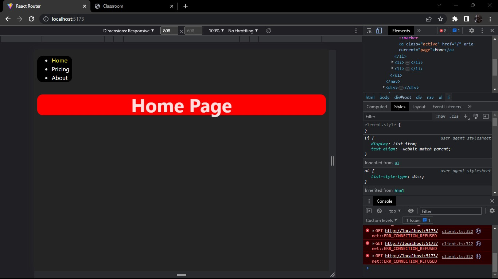

# Make It Real - Me gustan tus pestanas - React Router

This is a solution to the React Router
 project of the Make It Real course.

## Table of contents

- [Make It Real - Me gustan tus pestanas - React Router](#make-it-real---me-gustan-tus-pestanas---react-router)
  - [Table of contents](#table-of-contents)
  - [Overview](#overview)
    - [The challenge](#the-challenge)
    - [Screenshot](#screenshot)
  - [My process](#my-process)
    - [Built with](#built-with)
    - [What I learned](#what-i-learned)
    - [Continued development](#continued-development)
    - [Useful resources](#useful-resources)
  - [Author](#author)
  - [Acknowledgments](#acknowledgments)

## Overview

### The challenge

Users should be able to:

- Make click on the nav bar element 
- See the page content below 

### Screenshot

## My process

### Built with

- Semantic HTML5 markup
- CSS custom properties
- React
- React router

### What I learned

- I learned hoy to use React router,Links,Routes,Rout

### Continued development

-React router V6.4

### Useful resources

- [reactrouter.com](https://reactrouter.com/en/main) 

## Author

- Website - [Michael](https://github.com/Mike2020x)

## Acknowledgments
